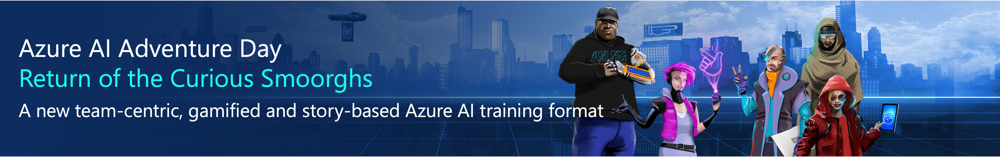

# Azure AI Adventure Day Player repository

This repository host the Azure AI Adventure Day player code

## What is Azure AI Adventure Day? ✨



Azure AI Adventure Day is an interactive team-based learning experience designed to enable attendees to test and learn new skills in a real-world, risk-free, challenging but also fun environment.

Participants will be working as a team to build an intelligent Agent to automatically respond to increasingly complex input questions using OpenAI. The Game Play itself will have a multi-phase narrative around deployment of resources, implementation of retrieval augmented generation, leveraging of function calling, ensuring security & content safety, tuning of cost, latency and efficiency. 

Attendees should have a basic understanding of Python. Azure experience is helpful. A highly recommended starting point is Azure AI Fundamentals and Introduction to OpenAI.

See https://aka.ms/azure-adventure-day

## Quickstart & Infrastructure setup

Regions that this deployment can be executed:
- northcentralus
- swedencentral
- eastus2
- westus3

**Important hint:**
Make sure you log into  a private browser session using the correct identity provided in the team portal and log into http://portal.azure.com there with this identity! Otherwise, you might end up using the wrong Azure subscription!
Make sure you are providing the device codes in this private browser session using the correct identity mentioned!

The following lines of code will connect your Codespace az cli and azd cli to the right Azure subscription:

```
# log in with the provided credentials - OPEN A PRIVATE BROWSER SESSION
az login --use-device-code

# "log into azure dev cli - only once" - OPEN A PRIVATE BROWSER SESSION
azd auth login --use-device-code

# press enter open up https://microsoft.com/devicelogin and enter the code

```

Now deploy the infrastructure components

```
# "provisioning all the resources with the azure dev cli"
azd up
```

Get the values for some env variables
```
# "get and set the value for AZURE_ENV_NAME"
source <(azd env get-values | grep AZURE_ENV_NAME)
```

Last but not least: deploy a dummy container in Azure Container Apps. 
```
echo "building and deploying the agent for phase 1"
bash ./azd-hooks/deploy.sh phase1 $AZURE_ENV_NAME

```

### Test the deployed resource

If the following request provides a useful answer, you are ready to go with Phase 1. Make sure to provide the correct URL.

```
PHASE1_URL="https://phase1....westus3.azurecontainerapps.io"

curl -X 'POST' \
  "$PHASE1_URL/ask" \
  -H 'accept: application/json' \
  -H 'Content-Type: application/json' \
  -d '{
  "question": "Who is the actor behind iron man?  1. Bill Gates, 2. Robert Downey Jr, 3. Jeff Bezos",
  "type": "multiple_choice",
  "correlationToken": "fgsdfgsd"
}'
```

## Inner Loop and local testing 

Go to directory src-agents/phase1 (for other phases, pick the correct folder) in bash.

Start up the agent api
```
pip install -r requirements.txt

uvicorn main:app --reload
```

This starts a local python webserver which hosts your main.py. Now you can work on localhost to test your application. If you get errors here, your stuff also won't run in the cloud.

### Phase 1 test

Test the api with eg:
```
URL='http://localhost:8000'
# URL='https://phase1..uksouth.azurecontainerapps.io'

curl -X 'POST' \
  "$URL/ask" \
  -H 'accept: application/json' \
  -H 'Content-Type: application/json' \
  -d '{
  "question": "Who is the actor behind iron man?  1. Bill Gates, 2. Robert Downey Jr, 3. Jeff Bezos",
  "type": "multiple_choice",
  "correlationToken": "1234567890"
}'
```

### Phase 2 test

```
curl -X 'POST' \
  "$URL/ask" \
  -H 'accept: application/json' \
  -H 'Content-Type: application/json' \
  -d '{
  "question": "Which of the options below is a correct genre for the movie The Smoorgh Crusade? Action, Drama, Comedy, Adventure",
  "type": "multiple_choice",
  "correlationToken": "1234567890"
}'

curl -X 'POST' \
  "$URL/ask" \
  -H 'accept: application/json' \
  -H 'Content-Type: application/json' \
  -d '{
  "question": "Does The Lost City have any sequels planned? True or False",
  "type": "true_or_false",
  "correlationToken": "1234567890"
}'
```

### Phase 3 test

```
curl -X 'POST' \
  "$URL/ask" \
  -H 'accept: application/json' \
  -H 'Content-Type: application/json' \
  -d '{
  "question": "When was the release year of Ant-Man and the Quantum Invasion? 1) 2026 2) 2022 3) 2020 4) 2027",
  "type": "multiple_choice",
  "correlationToken": "1234567890"
}'

```

## Deploy resources for Phase 1

Run the following script

```
azd env get-values | grep AZURE_ENV_NAME
source <(azd env get-values | grep AZURE_ENV_NAME)
bash ./azd-hooks/deploy.sh phase1 $AZURE_ENV_NAME
```

All the other phases work the same.

## Connect to Azure AI Search

The deployment will automatically inject the following environment variables into each running container:

```
AZURE_AI_SEARCH_NAME=
AZURE_AI_SEARCH_ENDPOINT=
AZURE_AI_SEARCH_KEY=
```

Here is some sample code that you can use to interact with the deployed Azure AI Search instance.

```
from azure.core.credentials import AzureKeyCredential
credential = AzureKeyCredential(os.environ["AZURE_AI_SEARCH_KEY"]) if len(os.environ["AZURE_AI_SEARCH_KEY"]) > 0 else DefaultAzureCredential()

from azure.search.documents import SearchClient

index_name = "movies-semantic-index"

search_client = SearchClient(
    os.environ["AZURE_AI_SEARCH_ENDPOINT"],
    azure_ai_search_index_name,
    AzureKeyCredential(azure_ai_search_api_key)
)

query = "What are the best movies about superheroes?"

results = list(search_client.search(
    search_text=query,
    query_type="simple",
    include_total_count=True,
    top=5
))
    
```